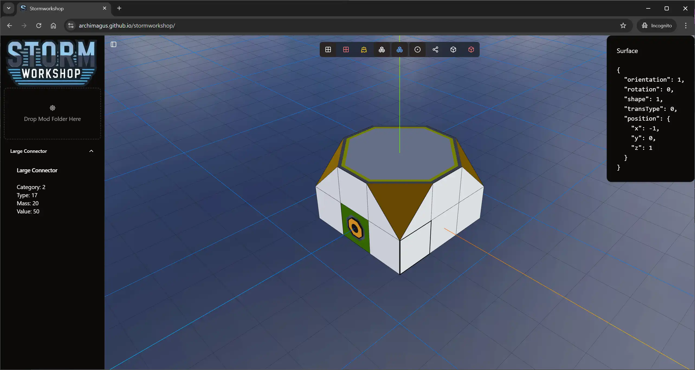

# Stormworkshop

A web-based mod editor for Stormworks: Build and Rescue. This tool allows you to view and edit part definitions and their associated meshes.

## Features

- 3D visualization of part definitions including:
  - Voxels
  - Surfaces
  - Buoyancy surfaces
  - Logic nodes
  - Meshes
- Interactive component inspection
- Support for viewing multiple parts simultaneously
- Drag-and-drop mod folder support
- Real-time component visibility toggling

## Getting Started

You can drag and drop your Stormworks mod folder into the application to load parts and their meshes.
Dragging in a part definition xml file will load just that part.

### Prerequisites

- Node.js (v18 or higher recommended)
- A modern web browser
- Stormworks: Build and Rescue mod files
